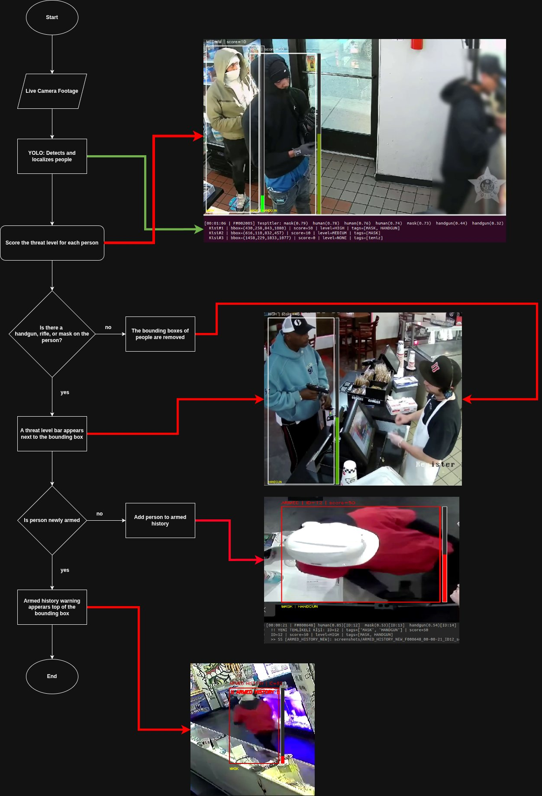
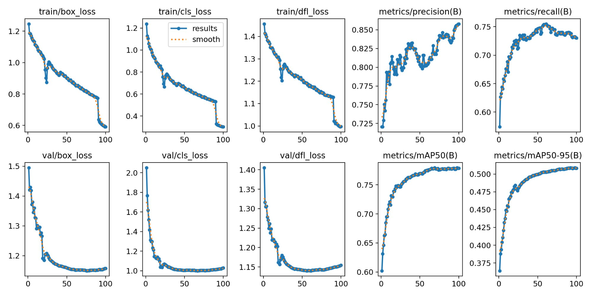
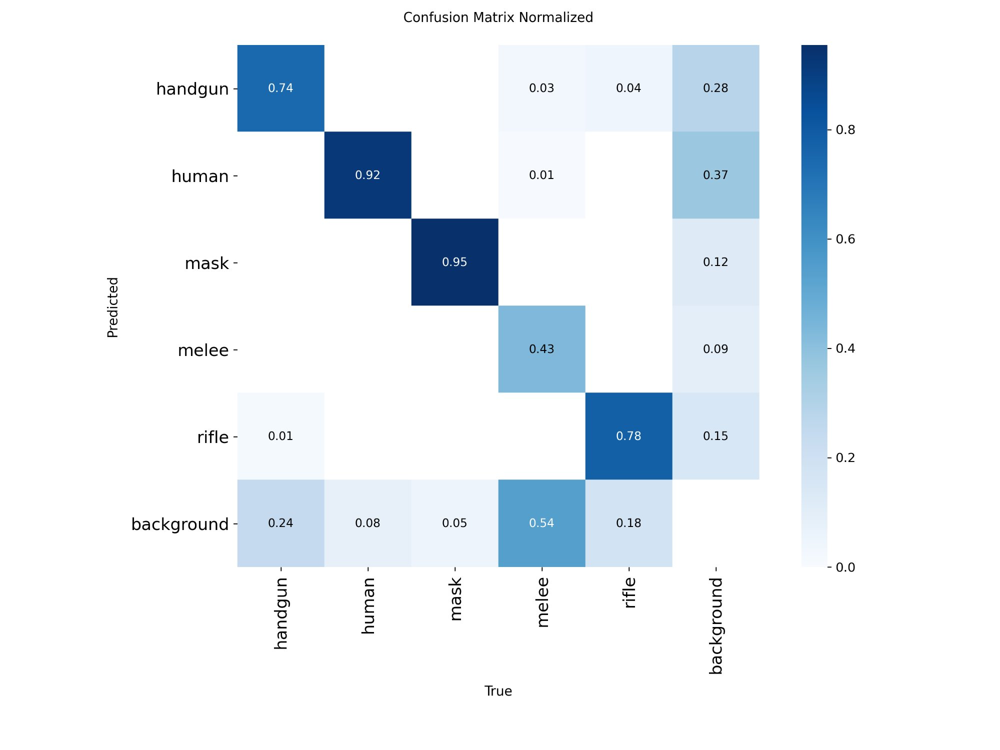
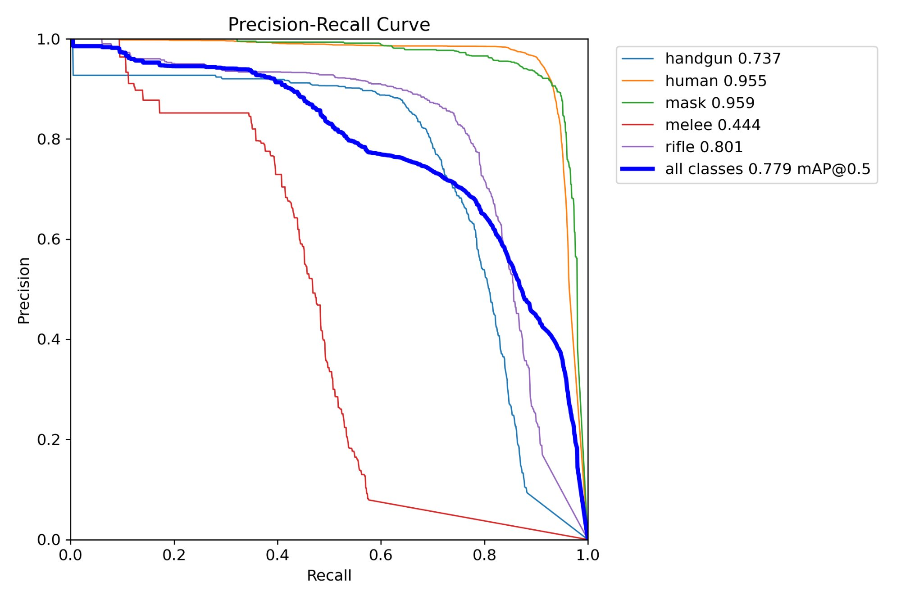

<div align="center">

#  Real-Time Threat Detection System
### Gerçek Zamanlı Tehdit Tespit Sistemi



[](https://python.org)
[](https://ultralytics.com)
[](https://developer.nvidia.com/cuda-toolkit)
[](LICENSE)
[]()

**Geliştirici / Developer:** Berkay Parçal

</div>

---


## 🇬🇧 English

### About

This system transforms passive CCTV infrastructure into an AI-powered proactive security decision-support platform. It combines YOLOv8l object detection, ByteTrack multi-object tracking, and an original **Armed History Memory** component to perform real-time threat assessment.

The system does not merely detect "weapon present" — it identifies **which person the weapon belongs to** through geometric analysis, and maintains the danger status of a suspect even if they conceal their weapon.

### Performance

| Class | Precision | Recall | mAP@0.5 |
|-------|-----------|--------|---------|
| Human | 0.950 | 0.910 | 0.955 |
| Mask | 0.915 | 0.928 | 0.959 |
| Rifle | 0.846 | 0.741 | 0.801 |
| Handgun | 0.803 | 0.694 | 0.737 |
| Melee | 0.764 | 0.387 | 0.444 |
| **ALL** | **0.856** | **0.732** | **0.779** |

> Model: `ft_20260304_0043` — YOLOv8l — 77 epochs — RTX 4060 — 10.3 ms/frame

### Key Features

-  **5-class detection:** Person, handgun, rifle, melee weapon, mask
-  **Armed History Memory:** Threat status persists even when weapon is concealed
-  **Hybrid weapon assignment:** IoU + Expanded Box (±35%) for accurate person-weapon matching
-  **Weighted threat scoring:** Mask +10 / Melee +25 / Handgun +40 / Rifle +50
-  **GUI launcher:** Source selection (MP4/webcam) and full settings via `launcher.py`
-  **Automatic evidence capture:** Timestamped screenshots + structured logs
-  **Modular architecture:** 8 independent modules, dependency injection

### Installation

```bash
git clone https://github.com/YOUR_USERNAME/rtds.git
cd rtds
conda create -n rtds_env python=3.10
conda activate rtds_env
pip install -r requirements.txt
python launcher.py
```

### System Requirements

- Python 3.10+
- NVIDIA GPU (CUDA 12.0+) — recommended: RTX 4060 or better
- Ubuntu 22.04 / 24.04

### Training Results

<div align="center">

<br/><em>Training and validation loss / metric curves (77 epochs)</em>

<br/><br/>


<br/><em>Normalized confusion matrix</em>

<br/><br/>


<br/><em>Precision-Recall curve (mAP@0.5 = 0.779)</em>
</div>

### Roadmap

- [ ] Melee class improvement (target mAP@0.5 ≥ 0.75)
- [ ] Multi-camera support + Re-Identification module
- [ ] Edge deployment (Jetson Nano, INT8 quantization)
- [ ] Web dashboard for centralized monitoring
- [ ] Automatic alarm integration

---

## 📄 License

This project is proprietary software. All rights reserved © 2026 Berkay Parçal.  
Unauthorized copying, distribution, or use of this software is strictly prohibited.  
See [LICENSE](LICENSE) for details.

---

<div align="center">
<sub>Developed by <strong>Berkay Parçal</strong> · 2026</sub>
</div>


## 🇹🇷 Türkçe

### Proje Hakkında

Bu sistem, geleneksel pasif CCTV altyapısını yapay zeka destekli proaktif bir güvenlik karar-destek platformuna dönüştürmektedir. YOLOv8l nesne algılama, ByteTrack çok-nesne takip ve özgün **Silahlı Geçmiş Hafıza Sistemi** bileşenlerini birleştirerek gerçek zamanlı tehdit değerlendirmesi yapar.

Sistem yalnızca "silah var" bilgisini üretmez; silahın **hangi kişiye ait olduğunu** geometrik analiz ile tespit eder ve şüpheli silahını saklasa dahi tehlike statüsünü oturum boyunca korur.

### Performans Metrikleri

| Sınıf | Precision | Recall | mAP@0.5 |
|-------|-----------|--------|---------|
| Human | 0.950 | 0.910 | 0.955 |
| Mask | 0.915 | 0.928 | 0.959 |
| Rifle | 0.846 | 0.741 | 0.801 |
| Handgun | 0.803 | 0.694 | 0.737 |
| Melee | 0.764 | 0.387 | 0.444 |
| **GENEL** | **0.856** | **0.732** | **0.779** |

> Model: `ft_20260304_0043` — YOLOv8l — 77 epoch — RTX 4060 — 10.3 ms/frame

### Özellikler

-  **5 sınıf tespiti:** İnsan, tabanca, tüfek, kesici alet, maske
-  **Silahlı Geçmiş Hafızası:** Şüpheli silahını saklasa dahi tehlike statüsü korunur
-  **Hibrit silah atama:** IoU + Expanded Box (±%35) ile doğru kişi-silah eşleşmesi
-  **Ağırlıklı tehdit skoru:** Maske +10 / Kesici +25 / Tabanca +40 / Tüfek +50
-  **Grafik başlatıcı:** `launcher.py` ile kaynak (MP4/webcam) ve ayar seçimi
-  **Otomatik kanıt kaydı:** Zaman damgalı screenshot + yapılandırılmış log
-  **Modüler mimari:** 8 bağımsız modül, dependency injection

### Mimari

```
RTDS/
├── launcher.py          # Grafik başlatıcı arayüz
├── main.py              # Giriş noktası — video döngüsü
├── requirements.txt
└── src/
    ├── config.py        # Merkezi konfigürasyon
    ├── detector.py      # YOLOv8l sarmalayıcı
    ├── scorer.py        # IoU + tehdit puanlama (saf fonksiyon)
    ├── tracker.py       # Armed History hafıza modülü
    ├── visualizer.py    # OpenCV çizim katmanı
    ├── logger.py        # Log + screenshot sistemi
    └── pipeline.py      # Frame orkestrasyonu
```

### Kurulum

```bash
# 1. Repoyu klonla
git clone https://github.com/YOUR_USERNAME/rtds.git
cd rtds

# 2. Sanal ortam oluştur (önerilen)
conda create -n rtds_env python=3.10
conda activate rtds_env

# 3. Bağımlılıkları yükle
pip install -r requirements.txt

# 4. Model yolunu ayarla
# src/config.py içindeki MODEL_PATH'i kendi best.pt yoluna güncelle

# 5. Başlat
python launcher.py
```

### Kullanım

`launcher.py` açıldığında:
1. **MP4 / Video** veya **Kamera (Webcam/USB)** seç
2. `CONF_THRESHOLD`, `EXPAND_SCALE` ve diğer ayarları düzenle
3. Model `.pt` dosyasını seç
4. ▶ **BAŞLAT** butonuna bas

### Gereksinimler

- Python 3.10+
- NVIDIA GPU (CUDA 12.0+) — önerilen: RTX 4060 veya üzeri
- Ubuntu 22.04 / 24.04

---

